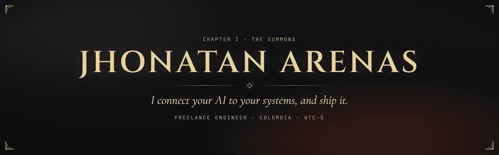
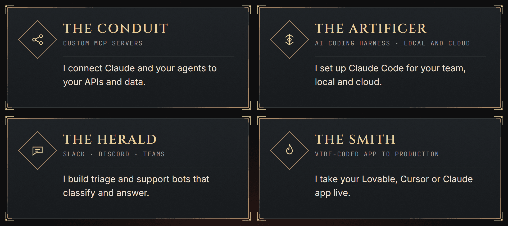
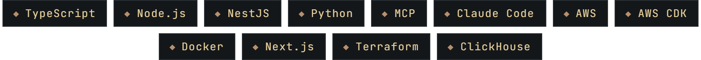

**Freelance engineer who connects your AI to your systems and ships it:** custom MCP servers, Claude Code setups for teams, Slack, Discord and Teams bots, and vibe-coded apps taken to production. Backend roots in Node.js, NestJS, Python and AWS. Languages: Spanish (native), English (B2).

<b>En español</b>

Ingeniero freelance. Ayudo a equipos a conectar la IA a sus sistemas y a llevarla a producción: servidores MCP a medida, configuración de Claude Code para equipos, bots de triage y soporte para Slack, Discord y Teams, y apps hechas con IA llevadas a producción. Idiomas: español (nativo), inglés (B2). Trabajo desde Colombia (UTC-5).

## Abilities

- **The Conduit, custom MCP servers.** I connect Claude and your agents to your APIs and data.
- **The Artificer, AI coding harness (local and cloud).** I set up Claude Code for your team, local and cloud.
- **The Herald, bots and agents for Slack, Discord and Teams.** I build triage and support bots that classify and answer.
- **The Smith, vibe-coded app to production.** I take your Lovable, Cursor or Claude app live.

## Quests

| Quest | What it is |
| --- | --- |
| [**context-engine-mcp**](https://github.com/cybernuki/context-engine-mcp) Built end to end, open source | MCP server that indexes code and searches it by meaning, so any MCP client gets relevant code context. |
| [**discord-triage-agent**](https://github.com/cybernuki/discord-triage-agent) Built end to end, open source | Discord triage bot that classifies messages with Jev and answers with a Bedrock agent. |
| [**Fulepu**](https://fulepu.com/) Built the AWS migration | Moved a learning company's apps onto one AWS stack with Cognito single sign-on. |
| [**Subinvoxa**](https://subinvoxa.com/) Co-founder & Tech Lead | DIAN-compliant electronic invoicing, from idea to a live product for multiple companies. |
| [**HostReach**](https://www.hostreach.io/) Backend engineer | Listing ingestion from Spanish portals with deduplication and ClickHouse, plus production fixes. |
| [**Buitrago Sánchez Asociados**](https://buitragosanchezasociados.com/) Built the tool for the client | Private tool that imports DIAN invoices, reconciles bank statements and files to Drive. |

## Arsenal

## Join the Party

Have a prototype, an agent or a team to set up? Tell me the quest.

  

<!-- PORTFOLIO_URL -->
